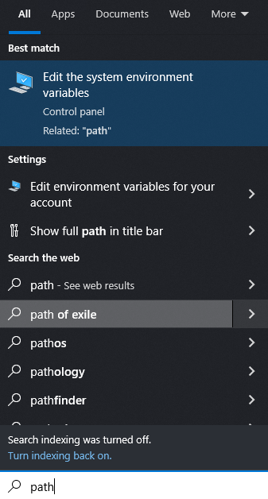
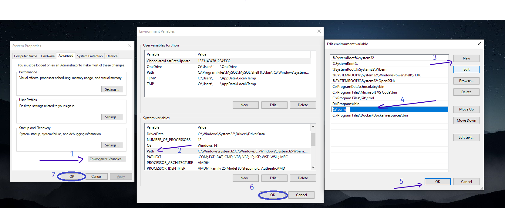

# OSRM - AREAS

## Pre requirements

### Windows

- Please download the [release archive](https://github.com/christophrust/osrmtime/releases/download/v1.3.3/osrmtime_release1.3.3.zip) and unpack it at a location of your choice.
  - Recommended:
    - Make `osrm` directory into `C:\`:
  - Uncompress the folder `osrm_win_v5.14` and `dll-x64`, and move all the files inside the `C:\osrm` folder.
  - At the end, the files inside the folder should have similar characteristics to this tree.
  ```
  |-- api-ms-win-crt-runtime-l1-1-0.dll
  |-- bicycle.lua
  |-- car.lua
  |-- debug_example.lua
  |-- examples
  |   `-- postgis.lua
  |-- foot.lua
  |-- lib
  |   |-- access.lua
  |   |-- destination.lua
  |   |-- guidance.lua
  |   |-- maxspeed.lua
  |   |-- pprint.lua
  |   |-- profile_debugger.lua
  |   |-- relations.lua
  |   |-- sequence.lua
  |   |-- set.lua
  |   |-- tags.lua
  |   |-- utils.lua
  |   `-- way_handlers.lua
  |-- libexpat.dll
  |-- lua.dll
  |-- msvcp140.dll
  |-- osrm-components.exe
  |-- osrm-contract.exe
  |-- osrm-customize.exe
  |-- osrm-datastore.exe
  |-- osrm-extract.exe
  |-- osrm-partition.exe
  |-- osrm-routed.exe
  |-- osrm.lib
  |-- osrm_contract.lib
  |-- osrm_customize.lib
  |-- osrm_extract.lib
  |-- osrm_partition.lib
  |-- osrm_store.lib
  |-- osrm_update.lib
  |-- psu_lat_long_radius.csv
  |-- rasterbot.lua
  |-- rasterbotinterp.lua
  |-- tbb.dll
  |-- tbbmalloc.dll
  |-- tbbmalloc_proxy.dll
  |-- test.lua
  |-- testbot.lua
  |-- turnbot.lua
  |-- vcomp140.dll
  |-- vcruntime140.dll
  ```
- Add `osrm` to path

  - `Edit the system enviroment variable`, `Environment Variables`, `System Variables`, `path`, `New` (`path/to/osrm/files/`), `ok` (x3)
    <!-- -  -->

    
    

## Features

- Allows downloading PBF files from `geofabrik.de`.
- Prepares all necessary files for route generation.
- Initializes the OSRM server in the background.
- Generates a route between 2 coordinate points.
- Generates all routes from a coordinate within a radius.
- Creates a shapefile with the endpoint coordinates of the destinations.

## Installation

From Github

```
pip install git+https://github.com/alexanderquispe/osrm_python
```

Specific branch

```
pip install git+https://github.com/alexanderquispe/osrm_python@{branch}
```

## Usage

### Download a file

```py
from osrmareas.downloader import GetPBF
download = GetPBF()
```

Methods, `GetPBF().continent()`, `GetPBF().country()` and `GetPBF().su_region()`, the methods
receive an array of continents, countries, and subregions,
which can be downloaded to a custom folder using the `.get('save\in\this\path')`
method. The path can be relative or absolute.
If not specified, it will create a `data_pbf` folder by default in the current execution folder.
You can force the download with the `get(force_download=True)` parameter.

```py
download.country(['peru', 'pakistan']).get(save_dir='country_pbf')
download.sub_region(['alberta']).get(save_dir='country_pbf')
```

The database can be called as follows:

```py
import osrmareas.downloader as dwnl
dwnl.cnt # continent
dnwl.cntry # continent, countries
dnwl.region # continent, countries, regions
```

### OSRM Connection

We define the file name and the directory path where the .pbf file is located.

```python
pbf_file = 'alberta-latest.osm' #{country, subregion}-latest.osm
pbf_file_path = 'path/to/dir/with/pbf/file'
```

- We use `Server` to generate routes for the execution files.

```python
from osrmareas.osrm import Server
cnd_alb = Server(pbf_file, pbf_file_path)
```

- We generate the necessary files with the following command lines.
  - If these files already exist, it will prompt for confirmation to execute them again.
  - These processes may consume 100% of the CPU.

```python
cnd_alb.gen_osrm_1()
cnd_alb.prepare_server_2()
```

- And we initialize the server in the background.

```python
cnd_alb.run_server()
```

### OSRM ROUTES

We can make route queries using `areas.get_osrm_routes(from, to)`.

```py
from osrmareas import areas
from_ = [53.550905, -113.268436]
to_ = [53.548449, -113.258648]
rt = areas.get_osrm_route(from_, to_)
rt.plot()
```

We can also obtain all routes within a default radius (in kilometers).

```python
all_rt=areas.get_routes(from_, 5)
all_rt
```

Finally, we can see a difference between the radius we defined in the area radius parameter.

```py
ameba = areas.get_ameba(all_rt, max_km = 5, alpha = 80, km_col='dist_driving_km')
```
